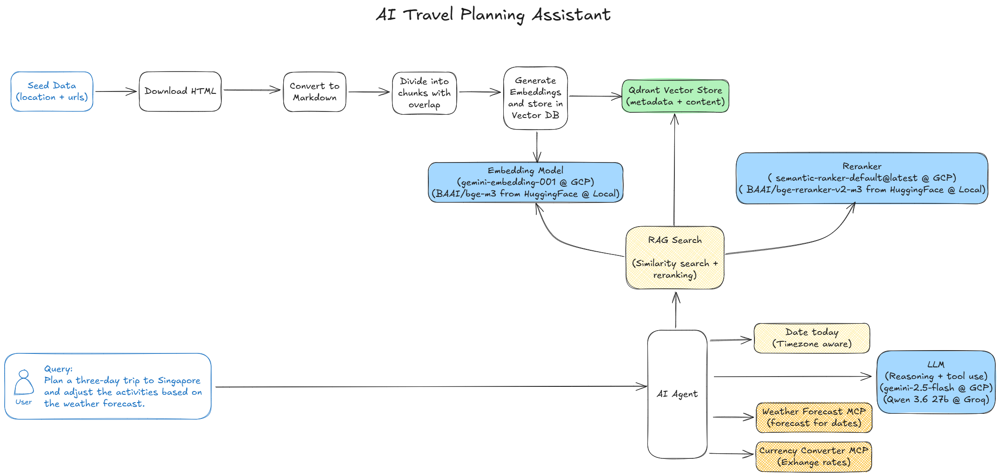

# AI Travel Planning Assistant

A Singapore travel-planning assistant that combines a grounded knowledge base with current weather, currency, and date information. The assistant uses retrieval-augmented generation (RAG) to answer tourism questions and can assemble or adjust itineraries through an interactive terminal session.

## What It Does

- Downloads and indexes Singapore travel content from configured web sources.
- Searches the indexed content with dense embeddings and optional reranking.
- Answers questions through a LangChain agent backed by Google Gemini.
- Retrieves current weather and currency information through external MCP servers.
- Preserves conversation state in memory for the duration of an agent session.

The current ingestion catalog is Singapore-only. The agent is intentionally constrained by [src/agent/system_prompt.md](src/agent/system_prompt.md): it does not book travel or invent unsupported facts, prices, or live information.

## Architecture



The main components are:

- `src/main.py`: Typer CLI with ingestion, RAG search, and agent commands.
- `src/ingestion/`: downloads sources, converts HTML to Markdown, chunks documents, and indexes them.
- `src/rag/`: vector retrieval and optional Google or Hugging Face reranking.
- `src/agent/`: LangChain agent, system prompt, and knowledge-base tools.
- `src/mcp_servers/`: MCP client configuration for weather and currency services.
- `docker-compose.yaml`: local Qdrant service.

## Prerequisites

- Linux, macOS, or Windows with a shell
- Python 3.12
- [uv](https://docs.astral.sh/uv/)
- Docker and Docker Compose
- A Google Cloud project with billing enabled for Gemini embeddings/chat and, when using the default reranker, the Discovery Engine Ranking API
- A Groq API key (required by the current settings model, even though the default agent uses Gemini)
- Reachable weather and currency MCP servers exposing the MCP HTTP endpoint

For Google Cloud authentication and IAM setup, see [gcp_setup.md](gcp_setup.md).

## Installation

From the repository root:

```sh
uv sync
uv run playwright install chromium
```

Start Qdrant:

```sh
docker compose up -d qdrant
```

Qdrant is available at `http://localhost:6333` by default. Stop it with:

```sh
docker compose down
```

## Configuration

The application reads settings from environment variables. Copy the following shape into `.env`, replace the placeholders, and export the values before running a command. Do not commit credentials.

```dotenv
GROQ_API_KEY=your-groq-api-key
GCP_API_KEY=your-gcp-api-key
GCP_PROJECT_ID=your-gcp-project-id

# Defaults shown here are optional unless you need to change them.
GCP_LOCATION=global
GCP_MODEL_NAME=gemini-2.5-flash
GCP_EMBEDDING_MODEL_NAME=gemini-embedding-001
GCP_RERANKER_MODEL_NAME=semantic-ranker-default@latest
VECTOR_STORE_URL=http://localhost:6333
VECTOR_STORE_COLLECTION=aitpa_knowledge_base
WEATHER_FORECAST_MCP_URL=http://localhost:8000/mcp
CURRENCY_CONVERTER_MCP_URL=http://localhost:8001/mcp
```

Load the file into the current shell:

```sh
set -a
source .env
set +a
```

Required settings are `GROQ_API_KEY`, `GCP_API_KEY`, and `GCP_PROJECT_ID`. Google client libraries also need Google Application Default Credentials. Authenticate locally with:

```sh
gcloud auth application-default login
gcloud auth application-default set-quota-project your-gcp-project-id
```

The complete list of tunable settings is defined in [src/config.py](src/config.py). Important provider options are:

| Setting | Default | Purpose |
| --- | --- | --- |
| `EMBEDDING_PROVIDER` | `gcp` | Use `gcp` or `hugging_face` for document embeddings |
| `RERANK_PROVIDER` | `gcp` | Use `gcp` or `hugging_face` for reranking |
| `RERANKING_ENABLED` | `true` | Enable the second-stage reranker |
| `SIMILARITY_SEARCH_RESULTS_LIMIT` | `20` | Number of vector-search candidates |
| `RERANKED_SEARCH_RESULTS_LIMIT` | `5` | Number of results returned after reranking |
| `FORCE_RECREATE_COLLECTION_ON_INGESTION` | `true` | Recreate the Qdrant collection before ingestion |

The Hugging Face embedding and reranking implementations currently request `device="cuda"`; use the GCP providers on machines without a CUDA-capable setup.

## Usage

View the available commands:

```sh
uv run python src/main.py --help
```

### 1. Build the knowledge base

Ingest the configured Singapore sources:

```sh
uv run python src/main.py extract-load-data Singapore
```

This command:

1. Creates the Qdrant collection.
2. Fetches each configured page with Playwright.
3. Saves the converted Markdown under `data/<timestamp>/`.
4. Splits the content into structure-aware chunks.
5. Embeds and stores the chunks in Qdrant.

The collection is recreated by default, so a new ingestion replaces the existing indexed content. Set `FORCE_RECREATE_COLLECTION_ON_INGESTION=false` only when you have confirmed that the collection lifecycle you want is compatible with the current ingestion code.

### 2. Inspect RAG search results

```sh
uv run python src/main.py rag-search
```

Enter a query at the prompt. The command prints vector scores, rerank scores, metadata, and retrieved page content. Exit with `Ctrl+C`.

### 3. Chat with the travel planner

```sh
uv run python src/main.py agent
```

The agent can search the knowledge base, resolve dates, and call the configured weather and currency MCP services. Example prompts:

```text
Create a three-day Singapore itinerary for next week and adjust it according to the weather forecast.
Convert my INR 60000 budget to SGD and suggest a three-day itinerary.
Suggest indoor alternatives if rain is expected during my trip.
```

Exit the session with `Ctrl+C`.

## MCP Services

The repository configures MCP clients but does not include the weather or currency server implementations. Start compatible services separately and expose their Streamable HTTP endpoints at:

- `WEATHER_FORECAST_MCP_URL`, default `http://localhost:8000/mcp`
- `CURRENCY_CONVERTER_MCP_URL`, default `http://localhost:8001/mcp`

The agent expects the weather service to provide forecast data and the currency service to provide current exchange rates. If either service is unavailable, the corresponding information cannot be supplied reliably.

## Data and Sources

Ingestion currently defines eight Singapore sources in [src/ingestion/ingestion.py](src/ingestion/ingestion.py), including Wikivoyage and Visit Singapore pages. Downloaded pages are generated artifacts stored in timestamped directories under `data/`; they are not the source of truth for the source URLs or the indexing configuration.

The default chunk size is 1,000 characters with 150 characters of overlap. Markdown headings are retained in chunk metadata and each chunk records its source URL, source label, ingestion timestamp, and position.

## Development Notes

There is no test suite or lint command configured in `pyproject.toml` yet. A basic smoke check after setup is:

```sh
uv run python src/main.py --help
docker compose ps
```

For sample conversations and expected agent behavior, see [sample_chats.md](sample_chats.md). For Google Cloud APIs and permissions, see [gcp_setup.md](gcp_setup.md).

## License

No license file is currently included in this repository.
